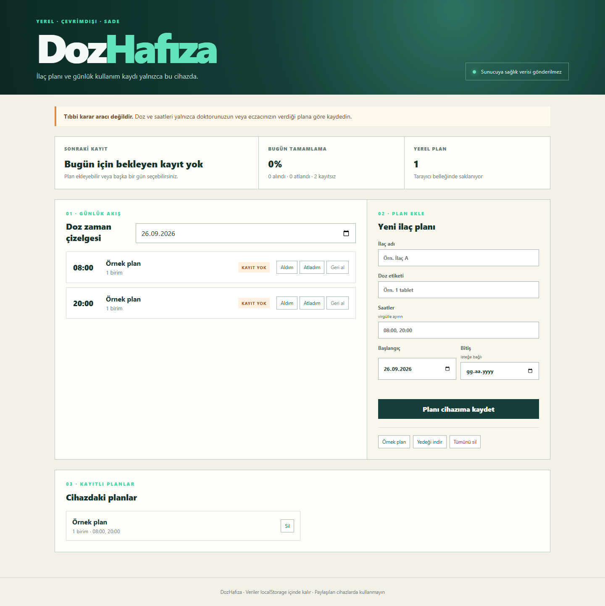

# DozHafıza

[](https://github.com/cantsdlnn/doz-hafiza/actions/workflows/ci.yml)

İlaç planını ve günlük “aldım / atladım” kaydını sunucuya sağlık verisi göndermeden, yalnızca kullanıcının cihazında tutan çevrimdışı PWA.

> Bu yazılım tıbbi karar veya doz önerisi üretmez. Kullanıcı yalnızca sağlık profesyonelinden aldığı planı kaydeder.

## Neden bu proje?

Kâğıt çizelgeler kolay kayboluyor; bulut tabanlı basit bir hatırlatıcı ise gereğinden fazla sağlık verisi toplayabiliyor. DozHafıza, temel günlük takip ihtiyacını yerel-öncelikli bir veri sınırıyla çözer. Paylaşılan cihazlarda kullanılmaması gerektiğini açıkça belirtir.



## Özellikler

- Bir veya birden çok günlük saat içeren ilaç planı
- Yaklaşan, zamanı gelen, kayıtsız, alınan ve atlanan durumları
- Gelecekteki kayıtları başarı oranına katmayan günlük özet
- Plan ve kayıtların yalnızca `localStorage` içinde tutulması
- JSON yedeği ve açık onaylı tüm-veri silme
- Çevrimdışı kullanım için PWA manifesti ve service worker
- XSS riskini azaltmak için kullanıcı metinlerinde HTML kaçışlama
- Deterministik zamanlama kuralları ve birim testleri

## Çalıştırma

```bash
npm install
npm run dev
```

Test ve üretim derlemesi:

```bash
npm test
npm run build
```

## Bilinçli sınırlar

Tarayıcı bildirimi, hesaplar arası eşitleme, bakıcı paylaşımı ve ilaç etkileşimi kontrolü yoktur. Cihaz saati değiştirilirse zaman çizelgesi de değişir. `localStorage` şifreli bir sağlık kayıt sistemi değildir; bu demo kişisel cihazdaki basit takip için tasarlanmıştır.

## AI kullanımı

Üretken yapay zekâyı gereksinim alternatifleri, sınır durumları ve test senaryoları üretmek için eşli geliştirme aracı olarak kullandım. Veri sınırı, zamanlama kuralları, tıbbi iddia yapmama kararı ve nihai doğrulama bana aittir. Ayrıntı: [AI_USAGE.md](AI_USAGE.md).

## Lisans

[MIT](LICENSE)
